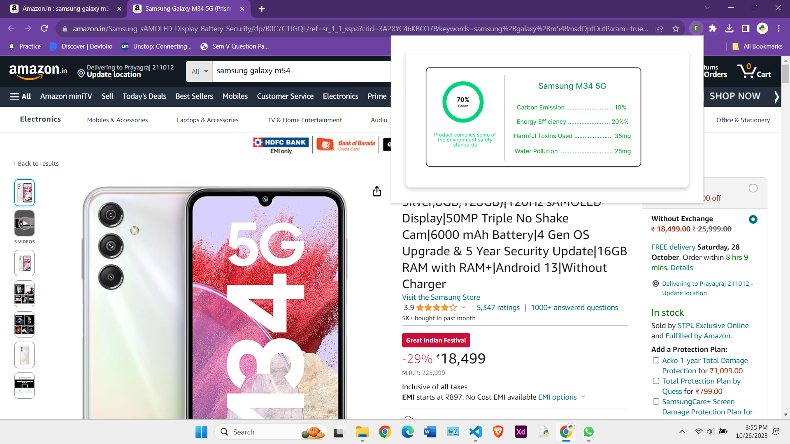

# Eco-Score

Eco Score Extension for E-commerce Websites

The Eco Score Extension for E-commerce Websites is a browser extension designed to provide users with valuable environmental information while shopping online.
By integrating this extension into an e-commerce website, users can easily access the eco score of a product.
The eco score is calculated based on various sustainability parameters, including carbon efficiency, water usage, packaging materials, and more.

This extension is built using Node.js for the server, HTML, CSS, and JavaScript for the frontend, and MySQL for database storage.
It offers a user-friendly interface and provides essential environmental data to help users make more informed and eco-conscious purchasing decisions.

